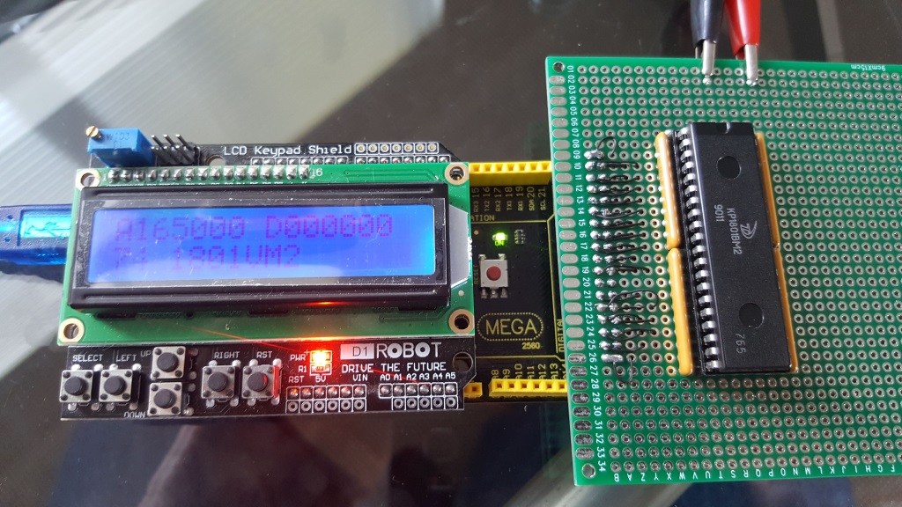

# RetroShield-KR1801VM2
RetroShield inspired project for the Soviet KR1081VM2 PDP-11 compatible processor

This is a work-in-progress project inspired by Erturk Kocalar's RetroShield project (https://gitlab.com/8bitforce).

RetroShield 1801VM2 is a hardware shield for Arduino Mega.
* It enables Arduino to emulate peripherals and run PDP-11 programs on a Soviet PDP-11 compatible processor.
* You can try PDP-11 assembly and run some of the old PDP-11 programs without building complicated circuits.
* You can use existing Arduino shields to extend the capabilities.
* The Arduino Mega sketch is inspired by my PDP-11/04 and includes the following DEC peripherals:  
   M7856 DL-11W SLU as a Console     
   M7856 DL-11W SLU as a TU58 Interface (not yet proven to actually boot anything)  
      M9312 Terminator/ROM board to host ROMs from https://www.ak6dn.com/PDP-11/M9312/     
* Schematic and the Arduino Sketch is provided for you to study and play.

